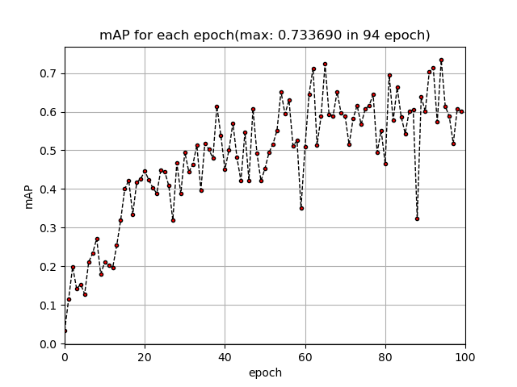
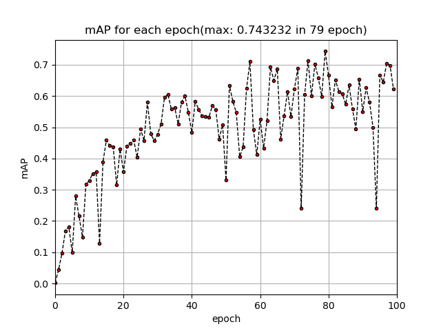

# Medical Mask Wearing Detection Model with Class Imbalanced Problem

---

# Abstract

*keyword : mask wearing detection, yolo v3, transfer learning, class imbalance, data augmentation, focal loss*<br>
최근 코로나 바이러스 문제로 인해 해당 질병의 전파 속도가 증가하고 있다. 이에 따라 정부는 마스크 착용, 손 씻기, 사회적 거리 두기 등을 권고하고 있는 상황이다. 마스크 착용을 통해 비말 감염을 예방할 수 있기 때문에 마스크를 착용하지 않는 사람은 특정 건물이나 대중교통을 이용하는 데에 제한을 두어 마스크 착용의 의무화를 시행하고 있다. 하지만 그럼에도 불구하고 마스크를 착용하지 않는 사람들을 쉽게 볼 수 있고, 이들을 일일히 관리하기란 힘든 일이다. 이러한 상황에서 마스크 착용에 대한 탐지를 자동화하는 시스템은 인력 낭비를 줄이고 효율적인 관리를 기대할 수 있을 것이다. 따라서 해당 프로젝트는 'Medical Mask Wearing Detection Model' 에 대한 내용을 담고 있다. Dataset 수집부터, Model 선택, Trasfer Learing에 관한 전반적인 내용을 다룬다. 특히 수집된 Dataset은 마스크를 착용한 사람(with_mask)에 비해, 착용하지 않은 사람(without_mask)이나 잘못 착용한 사람(mask_weared_incorrect)의 비율이 작은 문제를 가지고 있다. 따라서 이러한 Class Imbalanced Problem에 대한 고민과 문제를 해결하는 내용 또한 다루고 있다. github code는 아래 링크를 통해 확인할 수 있다.<br><br>

*code) https://github.com/YoonSungLee/PyTorch-YOLOv3* [0]

---

# 1. Introduction

코로나 바이러스가 더 이상 퍼지지 않도록 기여할 수 있는 우리의 가장 간단하고도 중요한 역할은 '마스크 착용' 이다. 길거리를 돌아다니면 쉽게 마스크 착용에 대한 포스터를 볼 수 있으며, 정부에서도 대중교통을 이용하기 위해 마스크 착용을 의무화하는 정책을 펼치고 있다. 나아가 기업에서도 마스크 착용 의무화를 위해 여러 서비스를 실시하고 있다. 예를 들어 LG CNS의 경우, 서울 마곡 본사 일부 출입 게이트에서 'AI 출입통제 서비스'를 활용하여 마스크를 착용한 직원만 통과시키도록 한다.[1]<br>
이는 서비스명에서도 알 수 있듯이 AI를 활용한 얼굴인식 기술이다. Dataset에서 유의미한 패턴을 찾아내는 Machine Learning Method 중에 하나인 Deep Learning Method는 점점 우리의 삶에 자리매김하고있다. Computer Vison, Natural Language Processing, Reinforcement Learning, GAN 등 다양한 분야에서 활발히 연구가 진행중이다. 특히 이번 프로젝트에서 알아볼 내용은 Computer Vision으로써, Image Dataset에서 어떻게 유의미한 정보를 찾아내는지에 관해 살펴본다.<br>
Deep Learning Method는 각 분야마다 깊숙히 그리고 활발히 연구 중에 있기 때문에, 분야가 세분화되어있다. 특히 이번 프로젝트에서 확인할 Computer Vision에 대한 분야 내에서도 Classification, Object Detection, Segmentation, Instance Segmentation 등 해결하고자 하는 문제에 따라 분류되어 있다고 할 수 있다. 이 중에서 '마스크 착용'을 확인하는 솔루션을 제시하기 위해서 어떤 문제로 분류할 수 있을까? Image 안에 여러 사람이 존재할 수 있기 때문에, 단순히 Classification을 적용하기에는 무리가 있다. 그렇다고 Segmentation이나 Instance Segmentation은 객체 추출을 통한 정교한 위치의 결과값까지 찾아주기 때문에, 해당 문제를 해결하는 데에 불필요한 정보를 얻는다. 결국 해당 문제는 사람에 대한 위치 정보를 Bounding Box를 통해 찾고, 동시에 그 사람이 마스크를 착용했는지에 대한 여부를 분류하면 되기 때문에, Object Detection 문제로 귀결된다고 할 수 있다. 따라서 해당 프로젝트는 마스크 착용 문제를 Object Detection 문제로 정의하고, 그에 따른 Dataset 구성, Model 설정 등의 업무를 수행한다.<br>
Object Detection 문제를 해결하기 위한 모델은 굉장히 많으며 각각의 특성을 가지고 있다. 해당 프로젝트를 수행하기 위해 조사한 바에 따르면, Detection 작동 원리에 따라 크게 두 가지 종류의 모델로 구분할 수 있다. 하나는 One-Stage Detection Model이고, 다른 하나는 Two-Stage Detection Model이다. 해당 프로젝트는 마스크 착용 여부를 실시간으로 파악하기를 원한다. 이에 따라 모델의 정확도 뿐만 아니라 실시간으로 수행할 정도의 속도를 가진 모델을 필요로 한다. 따라서 일반적으로 정확도 면에서 조금 떨어지지만 실시간으로 Detection을 수행할 수 있는 One-Stage Detection Model을 활용한다. 특히, 대중적이며 참고할 자료가 많은 YOLO v3 Model을 Custom Dataset에 Transfer Learning을 통해 활용하기로 한다.<br>
Deep Learning 모델을 학습시키는 데에 있어서, Dataset의 Class Balance 또한 중요한 요소이다. 단순한 예를 들어, 강아지와 고양이를 분류하기 위해 Image를 수집했다고 가정해보자. 강아지 Image가 90장, 고양이 Image가 10장 들어있는 Dataset을 모델이 잘 학습할 수 있을까? 모든 Training Dataset에 대하여 강아지라고만 예측해도 해당 모델의 성능(accuracy)은 90%이기 때문에, 이는 Test Dataset에 대해 강아지라고만 예측할 것이다. 따라서 Class의 비율을 적절히 조절하는 것 또한 모델의 성능을 높이는 요소 중의 하나라고 할 수 있다. 해당 프로젝트를 수행할 때 사용한 Dataset 또한 Class Imbalanced Problem을 가지고 있다. 따라서 이 문제를 어떻게 접근했는지, 그리고 어떻게 해결했는지에 대한 내용도 제시한다.<br>해당 프로젝트는 이전에 같은 주제로 한 번 수행한 바 있다.[2] 이전 프로젝트에서는 Model에 대한 이해와 Transfer Learning을 어떻게 수행하는지를 중점으로 두었다고 한다면, 이번 프로젝트는 더 나아가 Model의 코드를 이해 및 수정하고 더 나은 결과를 얻기 위해 연구를 수행하는 과정이 포함된다. 결론적으로 해당 프로젝트는 위와 같은 고민들을 거쳐, Object Detection의 성능 평가 기준 중의 하나인 mAP를 기준으로 **0.757417**이라는 비교적 높은 결과를 얻어냈다. 이에 대한 고찰과 앞으로 나아가야 할 연구방향에 대해서 언급함으로써 해당 프로젝트에 대한 설명을 마무리하도록 하겠다.

# 2. Related Work

## 2.1. Object Detection


Aritifical Intelligence 중의 하나인 Machine Learning, Machine Learning 중의 하나인 Deep Learning, Deep Learning 중의 하나인 Computer Vision, Computer Vision 중의 하나인 Object Detection이 우리가 해결하고자 하는 문제이다. Object Detection 문제는 Image 내의 하나 또는 여러 객체에 대하여 Bounding Box를 추출하고, 해당 객체의 클래스를 분류하는 것을 목적으로 한다. Computer Vision에 관한 개괄적인 내용이 필요하다면 [Report: Mask-R-CNN](https://github.com/YoonSungLee/Detection-Segmentation-Paper-Reivew-and-Report/blob/master/Report_Mask-R-CNN.md) [3] 편을, Object Detection 문제 해결 원리에 대한 내용이 필요하다면 [Report: Object Detection](https://github.com/YoonSungLee/Detection-Segmentation-Paper-Reivew-and-Report/blob/master/Report_Object-Detection.md) [4] 편을 참고하는 것을 권한다.

## 2.2. YOLO v3


Object Detection 모델 중의 하나인 YOLO v3는 One-Stage Detection Model 로써, Two-Stage Detection Model에 비해 빠른 속도를 보인다. 기존 YOLO 버전에 비해 3군데의 resolution에서 좀 더 많은 Bounding Box를 추출하기 때문에, 정확도 향상과 작은 물체에 대한 탐지 능력 향상 등의 효과를 얻을 수 있었다. 해당 모델에 대하여 어떻게 작동하는지에 대한 내용이 필요하다면 [How to Perform Object Detection With YOLOv3 in Keras](https://github.com/YoonSungLee/Detection-Segmentation-Project/blob/master/How_to_Perform_Object_Detection_With_YOLOv3_in_Keras.ipynb) [5] 편을 참고하는 것을 권고한다. 이 외에도 YOLO의 다른 버전에 대한 모델을 이해하고 싶다면, 논문 리뷰인 [Review: You Only Look Once: Unified, Real-Time Object Detection](https://github.com/YoonSungLee/Detection-Segmentation-Paper-Reivew-and-Report/blob/master/Paper_Review_YOLOv1.md) [6]과 [Review: YOLO9000: Better, Faster, Stronger](https://github.com/YoonSungLee/Detection-Segmentation-Paper-Reivew-and-Report/blob/master/Paper_Review_YOLO9000.md) [7]에서 그 내용을 확인할 수 있다.

## 2.3. Image Augmentation

Image Augmentation은 기존 데이터를 부풀리는 기법이다. 이를 통해 모델이 기존 데이터의 패턴 뿐만 아니라 부풀린 데이터에 의해 새로운 패턴을 발견하여, 모델의 성능을 좀 더 robust하게 만드는 효과를 볼 수 있다. Image Augmentation의 방법으로는 좌우 반전, 크롭(자르기), 밝기 조절, 회전, 이동, 확대 및 축소, 랜덤 노이즈 등 생각할 수 있는 모든 방법들이 해당한다. [9]<br>
Image Augmentation은 Class Imbalanced Problem을 해결하는데에도 사용할 수 있다. 앞서 언급한 예를 다시 들자면, 강아지 Image가 90장, 고양이 Image가 10장 포함된 Dataset을 가지고 있다고 해보자. 이 상태에서 모델에 학습시키면(물론 성능이 좋은 모델은 좋은 결과를 내겠지만), Class Imbalanced Problem 때문에 모델을 제대로 학습시킬 수 없다. 특히 Object Detection 모델의 성능 평가 기준 중의 하나인 mAP를 적용해보면, Class별로 AP의 차이가 큰 결과를 얻을 것이다. 이러한 경우에 고양이의 사진 10장을 Image Augmentation을 사용하면 어떻게 될까? 위에서 언급한 Image Augmentation의 방법을 적용하여 고양이의 사진을 10장에서 100장으로 부풀린다면, Class Imbalanced Problem이 해결되어 Class 별 AP가 일정한 결과를 기대할 수 있다.<br>
다만 Image Augmentation을 사용함에 있어서 고민해야 할 것은, hyperparameter setting이다. 위에서 언급한 여러 기법들 외에도 무수히 많은 Image Augmentation 기법들이 존재하며, 특정 기법 내에서도 각도, 거리 등 기법을 적용할 정도에 대한 hyperparameter를 직접 설정해주어야 한다. 따라서 어떤 Augmentation 기법을 사용하면 좋을지, 그리고 어떻게 hyperparameter를 setting해야할지를 주어진 문제에 따라 적용하는 skill이 필요하다.<br>
Image Augmentation을 코드로 확인하고 싶다면 github [Image Augmentation Tool](https://github.com/YoonSungLee/Image_Augmentation_Tool) [8] 을 참고할 수 있다.

## 2.4. Focal Loss


Class Imbalanced Problem을 해결할 수 있는 또 하나의 방법은 'Focal Loss for Dense Object Detection' 논문을 참고하면서 그 아이디어를 얻을 수 있다.<br>
Multi Class Image를 Classification하기 위해 사용하는 일반적인 loss function은 Cross Entropy Function이다. 이는 각 Class마다 probability의 log를 취해서 나온 결과의 음수값을 loss 값으로 설정함으로써, Class를 잘 맞추면(probability가 1에 가까워지면) loss 값이 작아지고 Class를 못 맞추면(probability가 0에 가까워지면) loss 값이 커지는 역할을 한다.<br>
문제는 Dataset의 Class가 Imabalance 할 때 발생한다. 다시 한 번 강아지와 고양이 Dataset을 예로 들어보겠다. 만약 일반적인 Cross Entropy Function을 사용한다면 어떤 문제가 발생할까? 학습 초기에 강아지 Image 하나에 대한 loss값과 고양이 Image 하나에 대한 loss값은 같을 것이다. 하지만 total loss값은 100장의 Image에 대한 loss값을 모두 합치므로 결국 강아지에 대한 loss값이 고양이에 대한 loss값보다 9배나 커지게 된다. 즉, 모델은 강아지에 대한 loss값을 줄여서 total loss값을 줄이는 방향으로 학습이 진행되기 때문에 결국 강아지는 잘 맞추고 고양이는 못 맞추는 문제가 발생하게 된다. 고양이 Image 하나에 대한 loss값이 아무리 크더라도, 절대적인 loss값들의 수가 작기 때문에 총합으로 봤을 때 밀리는 것이다.<br>
따라서 Focal Loss는 이러한 문제를 해결하기 위해 위의 그림과 같이 기존 Cross Entropy Function에 weight를 곱해준다. 이는 (1 - pt)^gamma의 값으로써, 만약 gamma의 값이 2라고 한다면 특정 Class를 잘 맞출수록(probability가 1에 가까워지면) (1-pt)^gamma의 값이 0에 가까워진 상태로 곱해진다. 즉, 잘 맞춘 Class에 대하여 down weight의 역할을 수행한다. 반대로 특정 Class를 못 맞출수록(probability가 0에 가까워지면) 곱해주는 값의 범위가 (물론 1보다는 작아지지만) 조금밖에 작아지지 않기 때문에, 해당 Class의 loss 값이 상대적으로 커지는 역할을 한다. 이것이 바로 Focal Loss의 핵심이라고 할 수 있다.<br>
해당 내용에 대하여 구체적으로 알기를 원한다면, 논문 리뷰인 [Review: Focal Loss for Dense Object Detection](https://github.com/YoonSungLee/Detection-Segmentation-Paper-Reivew-and-Report/blob/master/Paper_Review_Focal_Loss_for_Dense_Object_Detection.ipynb) [10]을 참고하는 것을 권고한다.

# 3. Experiments

## 3.1. Dataset


Mask Wearing Datset에 대한 수집 문제는 Kaggle[11]을 통해 간단히 해결했다.<br>
만약 웹에서 공개된 Dataset을 수집할 수 없다면 직접 크롤링을 하는 등의 방법을 사용해야 하는데, 해당 문제가 사람을 대상으로 하기 때문에 초상권 문제 등의 이슈를 고려해야 할 것이다. 하지만 위의 사진과 같이 Kaggle을 통해서 쉽게 데이터를 수집할 수 있었으며, 해당 Dataset은 초상권이나 저작권 문제를 고려하지 않아도 된다. 위의 첫 번째 사진의 License를 살펴보면 'CC0:Public Domain' 이라고 적혀 있는 것을 확인할 수 있다. 해당 라이센스는 '원저작물에 대하여 저작권자가 그 권리를 포기하거나 기부한 저작물'[12]을 의미하는 것으로, 누구나 자유롭게 이용이 가능하다.<br>
해당 Dataset에 대한 개괄적인 설명은 다음과 같다.

```
Contain
- 853 images(.png)
- 853 annotations(.xml)
```

```
Class
- With mask ---- 3232
- Without mask ---- 717
- Mask weared incorrect ---- 123
```

특히 Dataset 내에 있는 각 Class별 갯수를 counting하기 위해 Pytorch-YOLOv3[0]의 class_count.py를 작성하여 위와 같은 결과를 도출할 수 있었다.<br>이 과정을 통해 해당 Dataset은 Class Imbalanced Problem을 가지고 있다는 것을 확인할 수 있었다. with mask가 다른 class에 비해 압도적으로 그 수가 많은 상황이다. 다른 Dataset을 찾아볼 수도 있고, 크롤링을 통해 직접 annotation 작업을 수행할 수 도 있으며, 참신한 방법으로 GAN을 통해 원하는 class의 image를 생성할 수 도 있을 것이다. 하지만 여전히 초상권에 대한 이슈를 고려해야 할 것이며, 앞으로 Dataset을 다룰 때 이와 같은 Class Imbalanced Problem이 많이 나타날 가능성이 있을 것이다. 따라서 해당 Dataset을 사용하면서 문제를 해결해보는 식으로 방향을 수립했다.

## 3.2. Environment

* GeForce RTX 2080 Ti
* Window
* Pycharm
* Anaconda
* Pytorch

## 3.3. Transfer Learning

YOLO v3 Model에 Dataset을 학습시키려면 몇 가지 수행해야 할 작업들이 있다. .xml 파일을 .txt파일로 바꾸는 작업, classes 파일 생성 작업, image 경로 txt 파일 생성 작업 등이 이에 해당한다. 이에 대한 과정은 Pytorch-YOLO v3[0]의 README.md를 참고해서 이루어졌다.

## 3.4. Experiments

Transfer Learning의 epoch 수는 hyperparameter로써, 여러 실험을 통해 설정하거나 EarlyStopping 등의 기법을 사용하기도 한다. 해당 github repository의 defalut는 100으로 설정되어 있다. 그런데 그 시점 안에 overfitting이 발생하지 않을 수도 있기 때문에, mAP training graph를 살펴보고 100 epoch을 추가로 학습시켜주는 방법을 사용했다.

### 3.4.1. Original Dataset

```
Image: 853 <-- (train 752 + test 100)
- with_mask: 3232
- without_mask: 717
- mask_weared_incorrect: 123
```

가장 먼저 아무런 preprocessing 없이 주어진 Dataset을 그대로 학습시켰다.

### - 100 epoch


```
<Result>
maximum mAP: 0.674741 --> 92 epoch
+ Class '0' (with_mask) - AP: 0.759864
+ Class '1' (without_mask) - AP: 0.786043
+ Class '2' (mask_weared_incorrect) - AP: 0.478316
```

### - 200 epoch


```
<Result>
maximum mAP: 0.725457 --> 74 epoch
+ Class '0' (with_mask) - AP: 0.758708
+ Class '1' (without_mask) - AP: 0.863695
+ Class '2' (mask_weared_incorrect) - AP: 0.553968
```

*discussion*<br>
사실 첫 번째 실험을 수행하면서 Class Imbalanced Problem이 모델의 성능에 꽤 좋지 않은 영향을 준다는 것을 깨달았다. Dataset에 'with mask' class가 가장 많이 분포되어 있기 때문에, 해당 class의 mAP는 높게 측정된다. 반면에 'mask weared incorrect' class는 너무 적게 분포되어 있어서 mAP 또한 낮게 측정된다. 따라서 해당 problem을 해결하기 위해 여러 방법을 고민해보았고, 첫 번째로 Image Augmentation을 통해 해당 problem을 풀고자 했다.

### 3.4.2. Image Augmented Dataset

Class별로 mAP의 차이가 큰 이유는 Dataset의 Class Imbalanced Problem 때문이다. 따라서 해당 문제를 해결하기 위해서는 class 간 비율이 일정해야 하며, 이는 곧 'mask weared incorrect' class의 수가 상대적으로 증가해야한다.<br>
Dataset의 Image를 살펴보면, Medical Mask 관련 Dataset이라서 그런지는 몰라도 Image 내에 마스크를 착용한 사람은 많이 등장한다. 반면에 마스크를 착용하지 않은 사람이나 잘못 착용한 사람은 굉장히 드물며, 대부분의 이미지에서 살펴보기가 힘들다. 따라서 'mask weared incorrect' class가 존재하는 Image들을 모조리 뽑아내면 몇 장이나 될지 파악하는 작업을 거쳤다. 해당 과정은 Pytorch-YOLOv3[0]에서 Make_balance.py 코드를 작성하여 수행했다.<br>
결과는 다음과 같다.<br>

```
Image: 97
- with_mask : 624
- without_mask : 157
- mask_weared_incorrect : 123
```

Image의 수가 853장에서 97장으로 대폭 줄었다. 97장의 Image는 적어도 하나의 'mask weared incorrect' class를 가지고 있지만, Dataset이 너무 작기 때문에 모델을 학습한다고 하더라도 좋은 성능을 기대할 수는 없다. 따라서 Image Augmentation을 적용하여 데이터셋을 부풀리는 방법을 고려했다.<br>

Image Augmentation 기법[9]은 종류도 많을 뿐더러, 각 종류마다 기법을 적용할 정도를 결정하는 hyperparameter도 존재한다. 즉, 어떻게 설계하느냐에 따라 모델의 성능에 차이를 줄 수 있는 요소이다. 해당 프로젝트에서는 두 가지 요소를 고려하여 Augmentation 기법을 적용하였다.[8]<br>

1. Augmentation 1: scale(0.7, 0.7), rotate=15<br>
   YOLO model paper에서 성능 평가 결과를 살펴보면, 일반적으로 small object에 대한 성능이 다른 모델들에 비해 낮다는 특징을 가지고 있다. 따라서 Image의 scale을 줄이는 방법을 적용하여 small object에 대하여 물체가 잘 탐지할 수 있도록 했다.
2. Augmentation 2: GaussianNoise(loc=0, scale=(0.0, 0.15*255)<br>
   Deep Learning Vision 관련 교육에서, 기존 이미지에 Noise를 준 상태로 모델을 학습시키면 모델이 좀 더 robust하게 만들어준다는 노하우를 들은 적이 있다. 따라서 Image에 GaussianNoise를 주는 방법을 적용하여 모델이 좀 더 robust할 수 있도록 했다.

총 97장의 Image 중에서 Train Dataset 82장, Test Datset 15장을 남겨두었다. Train Dataset 82장을 대상으로 Augmentation 1번을 통해 82장을, Augmentation 2번을 통해 82장을 생성하였고, 이를 통해 총 Train Dataset = 82 + 82 + 82 = 246장을 구축했다. 또한 새로 구축한 Dataset에 대하여 class의 개수를 다시 한 번 출력해서 결과를 확인했다. 정리하자면 다음과 같다.

```
Image: 261 <-- (train 246 + test 15)
- with_mask: 1516
- without_mask: 405
- mask_weared_incorrect: 327
```

Augmentation을 적용한 97장의 Image는 (원본 Dataset보다는 조금 나아졌지만) 여전히 Class Imbalanced Problem이 존재했다. 따라서 이 상태로 Augmentation을 실시하더라도 비율을 동일하게 맞추기는 어렵다. 하지만 원본 Dataset에 비해서 Class Imbalanced Problem이 조금이나마 해결되었고, Dataset의 수도 증가시켰기 때문에 해당 Datset을 대상으로 실험을 수행했다. 실제 이 문제를 해결하기 위해서는 'mask weared incorrect' class를 crop을 해서 사용한다던지, 새로 Dataset을 구축한다던지 등의 시간을 요하는 작업이 필요하다.

### - 100 epoch


```
<Result>
maximum mAP: 0.568690 -→ 72 epoch
+ Class '0' (with_mask) - AP: 0.605556
+ Class '1' (without_mask) - AP: 0.234915
+ Class '2' (mask_weared_incorrect) - AP: 0.865600
```

### - 200 epoch


```
<Result>
maximum mAP: 0.589408 →  90 epoch
+ Class '0' (with_mask) - AP: 0.595541
+ Class '1' (without_mask) - AP: 0.333020
+ Class '2' (mask_weared_incorrect) - AP: 0.839664
```

*discussion*<br>
예상과는 달리 Image Augmentation을 적용했을때 오히려 전체적인 성능(mAP)이 떨어졌다. 또한 이상한 점은 'mask_weared_incorrect' class의 mAP가 증가한 대신, 'without_mask' class의 mAP가 감소하는 결과를 얻었다. 이 외에도 위의 그래프를 통해 100 epoch이 넘어서부터는 상대적으로 불안한 학습을 한다는 것을 확인할 수 있다. 이에 대한 원인은 여러가지가 있겠지만, 전체 Dataset 크기의 부족, 적합하지 않은 Augmentation 기법 적용, local minimum problem 등을 생각해 볼 수 있을 것이다.<br>
해당 상태에서 추가적인 Augmentation을 적용한다면 Class Imbalanced Problem이 심해질 것이고, 이는 곧 문제를 원점으로 돌아가게 만든다. 따라서 다른 방법이 필요했다. Class Imbalance에 관한 여러 paper를 찾아보다가, Cross Entropy Function이라는 Loss Function을 새로 정의하는 'Focal Loss for Dense Object Detection'[10]을 발견했다. 해당 기법을 적용할 계획을 세웠다.

### 3.4.3. Original Dataset + Focal Loss(alpha=1, gamma=2)

YOLO v3의 Loss Function에 Focal Loss를 적용하는 작업에 관한 가이드가 없어서 loss function의 수식 부분을 여러 자료를 참고하며 다시 한 번 살펴봤다.[13] YOLO v3는 obj와 noobj에 대하여 각각에 대한 Classification Loss가 존재하는데, 현재 문제는 물체냐 배경이냐에 대한 문제가 아니기 때문에 noobj 항에는 Focal Loss를 적용하지 않았다. 단지 obj 항에만 Focal Loss를 적용하여, 잘 학습되지 않는 class에 대해 가중치를 높게(엄밀히 말하면 모두의 가중치가 낮아지지만 잘 학습되지 않는 class의 가중치는 조금 낮아지도록) 부여하도록 했다. <br>
또한 Focal Loss는 alpha와 gamma라는 두 개의 hyperparameter가 존재한다. 따라서 아래와 같이 3가지 조건에 대한 실험을 통해 최적의 hyperparameter를 추출했다.

1. alpha balancing은 제거하고 gamma는 논문에 의거하여 사용: alpha=1, gamma=2
2. 논문에서 도출된 최적의 hyperparameter 사용: alpha=0.25, gamma=2
3. 논문에서 도출된 두 번째로 최적의 hyperparameter 사용: alpha=0.25, gamma=1

YOLO v3에 Focal Loss를 적용한 코드는 Pytorch-YOLOv3[0] github을 통해 확인할 수 있다.

```
Image: 853 <-- (train 752 + test 100)
- with_mask: 3232
- without_mask: 717
- mask_weared_incorrect: 123
```

### - 100 epoch



```
<Result>
maximum mAP: 0.733690 -→ 94 epoch
+ Class '0' (with_mask) - AP: 0.779732
+ Class '1' (without_mask) - AP: 0.688204
+ Class '2' (mask_weared_incorrect) - AP: 0.733135
```

### - 200 epoch


```
<Result>
maximum mAP: 0.724188 --> 91 epoch
+ Class '0' (with_mask) - AP: 0.783647
+ Class '1' (without_mask) - AP: 0.803041
+ Class '2' (mask_weared_incorrect) - AP: 0.585877
```

*discussion*<br>
놀랍게도 class별 mAP의 차이가 꽤 많이 좁혀졌다. 100 epoch을 넘어가면서 불안정한 성능을 보이기는 하지만, 각 class의 AP가 골고루 상승하여 전체적인 mAP가 상승했다. 따라서 Focal Loss를 적용함으로써 Class Imbalanced Problem 문제를 해결할 수 있다고 생각했다.

### 3.4.4. Original Dataset + Focal Loss(alpha=0.25, gamma=2)(Best!)

```
Image: 853 <-- (train 752 + test 100)
- with_mask: 3232
- without_mask: 717
- mask_weared_incorrect: 123
```

### - 100 epoch


```
<Result>
maximum mAP: 0.749394 --> 90 epoch
+ Class '0' (with_mask) - AP: 0.750385
+ Class '1' (without_mask) - AP: 0.842590
+ Class '2' (mask_weared_incorrect) - AP: 0.655206
```

### - 200 epoch(Best!)


```
<Result>
maximum mAP: 0.757417 --> 22 epoch
+ Class '0' (with_mask) - AP: 0.790415
+ Class '1' (without_mask) - AP: 0.799295
+ Class '2' (mask_weared_incorrect) - AP: 0.682540
```

*discussion*<br>
해당 실험은 alpha balancing을 제거하지 않은 채, paper에서 제시한 최적의 hyperparameter를 적용하여 모델을 학습한 결과이다. 마찬가지로 Class Imbalacned Problem을 해결했으며, 놀랍게도 지금까지의 실험 중에 가장 높은 mAP 결과를 얻을 수 있었다. 122 epoch을 기준으로 더 이상 모델의 성능이 증가하지는 않았다.

### 3.4.5. Original Dataset + Focal Loss(alpha=0.25, gamma=1)

```
Image: 853 <-- (train 752 + test 100)
- with_mask: 3232
- without_mask: 717
- mask_weared_incorrect: 123
```

### - 100 epoch



```
<Result>
maximum mAP: 0.743232 --> 79 epoch
+ Class '0' (with_mask) - AP: 0.763535
+ Class '1' (without_mask) - AP: 0.792701
+ Class '2' (mask_weared_incorrect) - AP: 0.673460
```

### - 200 epoch


```
<Result>
maximum mAP: 0.749586 --> 8 epoch
+ Class '0' (with_mask) - AP: 0.791903
+ Class '1' (without_mask) - AP: 0.802906
+ Class '2' (mask_weared_incorrect) - AP: 0.653950
```

해당 실험은 마찬가지로 alpha balancing은 제거하지 않은 채, paper에서 제시한 2번째로 최적의 hyperparameter를 적용하여 모델을 학습한 결과이다. 이 또한 마찬가지로 Class Imbalanced Problem은 해결했지만, 최적의 hyperparameter를 적용한 모델보다는 성능이 아주 조금 떨어지는 결과를 확인할 수 있었다. 이를 통해 Focal Loss를 적용함에 있어서, 해당 프로젝트의 Dataset은 paper에서 제시한 hyperparameter를 적용하는 것이 가장 좋은 성능을 낼 수 있다는 점을 확인했다.

## 3.5. Evaluation

위의 Experiments를 정리하자면 다음과 같다.<br>

| Experiment number | Loss Fucntion |  alpha   | gamma | with_mask AP | without_mask AP | mask_weared_incorrect AP | maximum mAP  |
| :---------------: | :-----------: | :------: | :---: | :----------: | :-------------: | :----------------------: | :----------: |
|         1         |      CE       |    1     |   0   |   0.758708   |    0.863695     |         0.553968         |   0.725457   |
|         2         |    CE(Aug)    |    1     |   0   |   0.595541   |    0.333020     |         0.839664         |   0.589408   |
|         3         |      FL       |    1     |   2   |   0.779732   |    0.688204     |         0.733135         |   0.733690   |
|       **4**       |    **FL**     | **0.25** | **2** | **0.790415** |  **0.799295**   |       **0.682540**       | **0.757417** |
|         5         |      FL       |   0.25   |   1   |   0.791903   |    0.802906     |         0.653950         |   0.749586   |

총 5번에 걸친 실험의 결과를 종합해서 가장 좋은 성능을 내는 모델을 정리하자면 다음과 같다.<br>
 YOLO v3 모델을 Transfer Learning하기 위해 사용한 Custom Dataset은 총 853장으로, 'with mask' class 3232개, 'without mask' class 717개, 'mask weared incorrect' class 123개로 구성되어 있다. class 비율을 통해 해당 Dataset은 Class Imbalacned Problem을 가지고 있다는 것을 확인할 수 있다. YOLO v3 모델에 alpha=0.25, gamma=2의 hyperparameter를 설정한 Focal Loss를 적용함으로써 Class Imbalanced Problem을 해결할 수 있으며, 이에 따라 모델의 성능 또한 가장 높일 수 있다. 해당 방법을 통해 모델을 122 epoch 학습한 상태에서 가장 좋은 성능을 확인할 수 있었는데, 이 때 모델의 성능은 'with mask' AP 0.790415, 'without mask' AP 0.799295, 'mask weared incorrect' AP 0.682540이며, 따라서 모델의 mAP는 0.757417이다.

# 4. Conclusion

*making*

# 5. Discussion

*making<br>
YOLO v3 focal loss in paper<br>
Image Augmentation Guideline<br>
Recall<br>*

# 6. Reference

[0] [Pytorch-YOLOv3](https://github.com/YoonSungLee/PyTorch-YOLOv3)<br>
[1] ["마스크 착용한 분만 문 열어 드립니다"](https://blog.lgcns.com/2216), LG CNS<br>
[2] [Mask-Wearing-Detection-Project-with-YOLOv3](https://github.com/YoonSungLee/Mask-Wearing-Detection-Project-with-YOLOv3), YoonSungLee<br>
[3] [Report: Mask-R-CNN](https://github.com/YoonSungLee/Detection-Segmentation-Paper-Reivew-and-Report/blob/master/Report_Mask-R-CNN.md), YoonSungLee<br>
[4] [Report: Object Detection](https://github.com/YoonSungLee/Detection-Segmentation-Paper-Reivew-and-Report/blob/master/Report_Object-Detection.md), YoonSungLee<br>
[5] [How to Perform Object Detection With YOLOv3 in Keras](https://github.com/YoonSungLee/Detection-Segmentation-Project/blob/master/How_to_Perform_Object_Detection_With_YOLOv3_in_Keras.ipynb), YoonSungLee<br>
[6] [Review: You Only Look Once: Unified, Real-Time Object Detection](https://github.com/YoonSungLee/Detection-Segmentation-Paper-Reivew-and-Report/blob/master/Paper_Review_YOLOv1.md), YoonSungLee<br>
[7] [Review: YOLO9000: Better, Faster, Stronger](https://github.com/YoonSungLee/Detection-Segmentation-Paper-Reivew-and-Report/blob/master/Paper_Review_YOLO9000.md), YoonSungLee<br>
[8] [Image Augmentation Tool](https://github.com/YoonSungLee/Image_Augmentation_Tool), YoonSungLee<br>
[9] [Data Preprocessing & Augmentation](https://nittaku.tistory.com/272), nittaku<br>
[10] [Review: Focal Loss for Dense Object Detection](https://github.com/YoonSungLee/Detection-Segmentation-Paper-Reivew-and-Report/blob/master/Paper_Review_Focal_Loss_for_Dense_Object_Detection.ipynb), YoonSungLee<br>
[11] [Face Mask Detection](https://www.kaggle.com/andrewmvd/face-mask-detection?select=images), Kaggle<br>
[12] [CC0 라이센스란? 재배포, 상업적 이용, 출처표시등 알아보기](https://webisfree.com/2015-05-19/cc0-라이센스란-재배포-상업적-이용-출처표시등-알아보기)<br>
[13] [YOLO의 loss function에 대해](https://brunch.co.kr/@kmbmjn95/35), 김범준